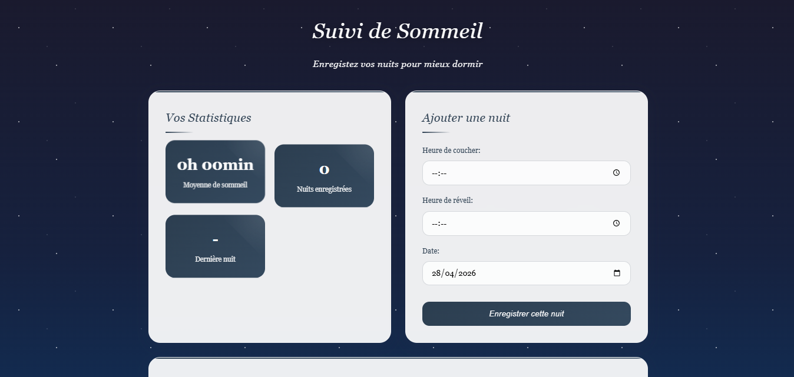

# Sleep_Tracking

## Description
Application web permettant d’enregistrer et de suivre ses heures de sommeil afin d’analyser la durée des nuits et améliorer ses habitudes.  
Ce projet est le **trente-sixième** du défi personnel **100 projets en 2026**.

---

## Objectifs du projet
- Manipuler les dates et heures
- Calculer des durées (coucher → réveil)
- Implémenter un CRUD simple
- Stocker des données localement
- Concevoir une interface utile et intuitive

---

## Plateforme
- Web (navigateur)

---

## Technologies utilisées
- HTML
- CSS
- JavaScript (Vanilla)

---

## Fonctionnalités
- Ajout d’une session de sommeil
  - Heure de coucher
  - Heure de réveil
- Calcul automatique de la durée de sommeil
- Historique des nuits enregistrées
- Calcul de la moyenne de sommeil
- Suppression d’une session

---

## Design & UX
- Interface douce et apaisante
- Carte principale pour la saisie
- Affichage clair des durées
- Historique lisible (liste ou cartes)
- Responsive (mobile et desktop)

---

## Captures d’écran

---

## Ce que j’ai appris
- Manipulation des objets `Date`
- Calculs de durée en JavaScript
- Gestion du stockage local (`localStorage`)
- Mise à jour dynamique du DOM
- Structuration d’un CRUD simple

---

## Améliorations possibles
- Graphique des nuits
- Indicateur de qualité du sommeil
- Objectif d’heures (ex : 8h)
- Filtre par semaine ou mois
- Mode sombre

---

## Statut du projet
 **Projet terminé**